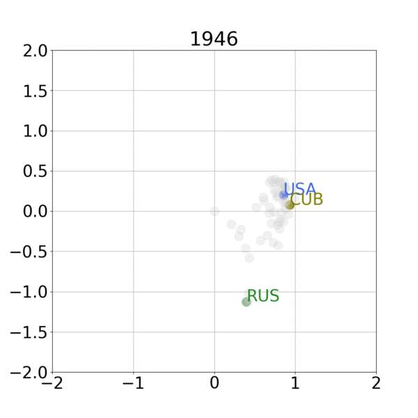

# efficient-ASE

Gradient-based ASE implementation, as proposed in "Gradient-Based Spectral Embeddings of Random Dot Product Graphs" (M. Fiori, B. Marenco, F. Larroca, P. Bermolen and G. Mateos, working draft)

## Installation

Clone repository and install dependencies using requirements file:

`pip install -r requirements.txt`

Install the following fork of [Pymanopt](https://github.com/pymanopt/pymanopt) in order to use the manifold of matrices with orthogonal columns:

`pip install git+https://github.com/marfiori/pymanopt`

## Try it

Run the UN general assembly votes example:

`python un_votes.py path_to_UN_data_file`

where `path_to_UN_data_file` is your local path to the [UN General Assembly Voting Data](https://dataverse.harvard.edu/dataset.xhtml?persistentId=hdl:1902.1/12379) file. If it does not exist, it will be downloaded to that path.
